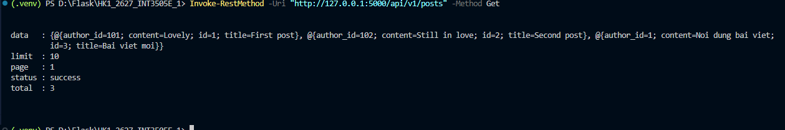
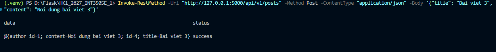
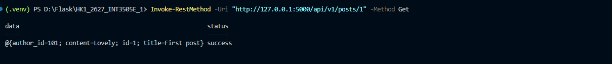
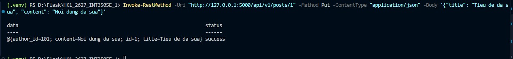
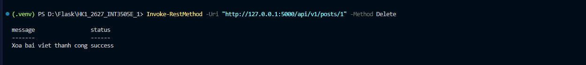

1. Xác định resources trong miền
- User: Người dùng hệ thống
- Profile: Thông tin hồ sơ cá nhân của người dùng
- Post: Bài viết
- Comment: Bình luận trong bài viết
- Tag: Thẻ đính kèm bài viết
- Follow: Mối quan hệ theo dõi giữa người dùng

2. Phân loại Collection / Item / Sub-resource

- Collection Resource:
  + /users (Tập hợp người dùng)
  + /posts (Tập hợp bài viết)
  + /tags (Tập hợp các thẻ)

- Item Resource:
  + /users/{user_id} (Một người dùng cụ thể)
  + /posts/{post_id} (Một bài viết cụ thể)
  + /tags/{tag_id} (Một thẻ cụ thể)

- Sub-resource (Item):
  + /users/{user_id}/profile (Hồ sơ cá nhân của người dùng)
  + /posts/{post_id}/comments/{comment_id} (Một bình luận cụ thể)

- Sub-resource (Collection):
  + /users/{user_id}/following (Danh sách tác giả người dùng đang theo dõi)
  + /users/{user_id}/followers (Danh sách người dùng đang theo dõi người này)
  + /posts/{post_id}/comments (Danh sách bình luận của bài viết)
  + /posts/{post_id}/tags (Danh sách thẻ của bài viết)

3. Sơ đồ cây Endpoint & Version Segment (API Version: /api/v1)

/api/v1
├── /users
│   ├── GET    / (Lấy danh sách user)
│   ├── POST   / (Tạo user)
│   └── /{user_id}
│       ├── GET    / (Chi tiết user)
│       ├── PUT    / (Cập nhật user)
│       ├── DELETE / (Xóa user)
│       ├── /profile
│       │   ├── GET   / (Xem hồ sơ)
│       │   └── PUT   / (Sửa hồ sơ)
│       ├── /following
│       │   ├── GET   / (Xem danh sách đang theo dõi)
│       │   ├── POST  / (Theo dõi người dùng)
│       │   └── /{target_user_id}
│       │       └── DELETE / (Bỏ theo dõi)
│       └── /followers
│           └── GET   / (Xem người theo dõi)
├── /posts
│   ├── GET    / (Lấy danh sách bài viết)
│   ├── POST   / (Tạo bài viết mới)
│   └── /{post_id}
│       ├── GET    / (Xem chi tiết bài viết)
│       ├── PUT    / (Sửa bài viết)
│       ├── DELETE / (Xóa bài viết)
│       ├── /comments
│       │   ├── GET    / (Lấy danh sách bình luận)
│       │   ├── POST   / (Tạo bình luận)
│       │   └── /{comment_id}
│       │       ├── PUT    / (Sửa bình luận)
│       │       └── DELETE / (Xóa bình luận)
│       └── /tags
│           ├── GET    / (Xem các thẻ của bài viết)
│           ├── POST   / (Gắn thẻ bài viết)
│           └── /{tag_id}
│               └── DELETE / (Gỡ thẻ khỏi bài viết)
└── /tags
    ├── GET    / (Lấy tất cả các thẻ)
    ├── POST   / (Tạo thẻ mới)
    └── /{tag_id}
        └── /posts
            └── GET    / (Lấy các bài viết thuộc thẻ)

*Danh sách Endpoint chi tiết

1. Bài viết (Posts)
- GET /api/v1/posts
- POST /api/v1/posts
- GET /api/v1/posts/{post_id}
- PUT /api/v1/posts/{post_id}
- DELETE /api/v1/posts/{post_id}

2. Bình luận (Comments)
- GET /api/v1/posts/{post_id}/comments
- POST /api/v1/posts/{post_id}/comments
- PUT /api/v1/posts/{post_id}/comments/{comment_id}
- DELETE /api/v1/posts/{post_id}/comments/{comment_id}

3. Thẻ (Tags)
- GET /api/v1/tags
- POST /api/v1/tags
- GET /api/v1/posts/{post_id}/tags
- POST /api/v1/posts/{post_id}/tags
- DELETE /api/v1/posts/{post_id}/tags/{tag_id}
- GET /api/v1/tags/{tag_id}/posts

4. Người dùng & Hồ sơ (Users & Profile)
- GET /api/v1/users
- POST /api/v1/users
- GET /api/v1/users/{user_id}
- GET /api/v1/users/{user_id}/profile
- PUT /api/v1/users/{user_id}/profile

5. Theo dõi (Follows)
- GET /api/v1/users/{user_id}/following
- POST /api/v1/users/{user_id}/following
- DELETE /api/v1/users/{user_id}/following/{target_user_id}
- GET /api/v1/users/{user_id}/followers

VD: 
GET: 
POST: 
GET: 
PUT: 
DELETE: 